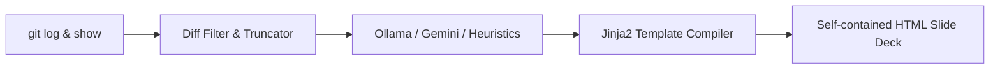

<p align="center">
  <h1 align="center">📖 git-story</h1>
  <p align="center">
    <strong>Interactive Git History & Codebase Architecture Evolution Slide-Deck Generator.</strong>
  </p>
  <p align="center">
    <a href="https://github.com/shivamtyagi18/git-story/stargazers"></a>
    <a href="https://github.com/shivamtyagi18/git-story/blob/main/LICENSE"></a>
    
  </p>
</p>

---

## 🚀 What is git-story?

**git-story** is a CLI tool that parses your Git logs and file diffs, passes them through a local LLM (Ollama) or Gemini API to summarize structural and design changes, and generates a portable, interactive HTML slide-deck that visually plots your codebase's architectural evolution.



---

## ✨ Features

*   **🔍 Architecture-Focused Parsing**: Excludes noisy dependency lockfiles, binary files, and documentation assets, feeding only high-value code structural changes to the LLM.
*   **🤖 Multi-LLM Orchestration**: Supports local models via **Ollama** (e.g. `llama3`), **Gemini API** via direct configuration, or a **local heuristic algorithm** for zero-cost static summaries.
*   **📽️ Dynamic Mermaid.js Timeline**: Creates a responsive presentation slide-deck that maps directory architectures. Watch modules blink green on creation, display in dotted red on deletion, and active nodes update as you step through commits.
*   **📄 Self-Contained Output**: Compiles into a single, portable, dependency-free HTML file containing all assets, styles, and data ready to share with teams.

---

## 📦 Quick Start

### Installation
Install the package in editable mode locally:

```bash
git clone https://github.com/shivamtyagi18/git-story.git
cd git-story
pip3 install -e .
```

### Usage
Run the tool against any Git repository to generate your interactive story deck:

```bash
# 1. Generate using the fast local heuristic engine (No API Keys needed)
git-story -p /path/to/repo -n 15 -o my-story.html

# 2. Generate using a local Ollama model
git-story -p /path/to/repo -t ollama -m llama3 -o my-story.html

# 3. Generate using Gemini
export GEMINI_API_KEY="your-api-key"
git-story -p /path/to/repo -t gemini -m gemini-1.5-flash -o my-story.html
```

Open **`my-story.html`** in any web browser to view your codebase's evolutionary timeline.

---

## 🤝 Contributing

Contributions are welcome! Feel free to open an issue or submit a pull request. 

Give us a star ⭐ if you find this tool helpful!
